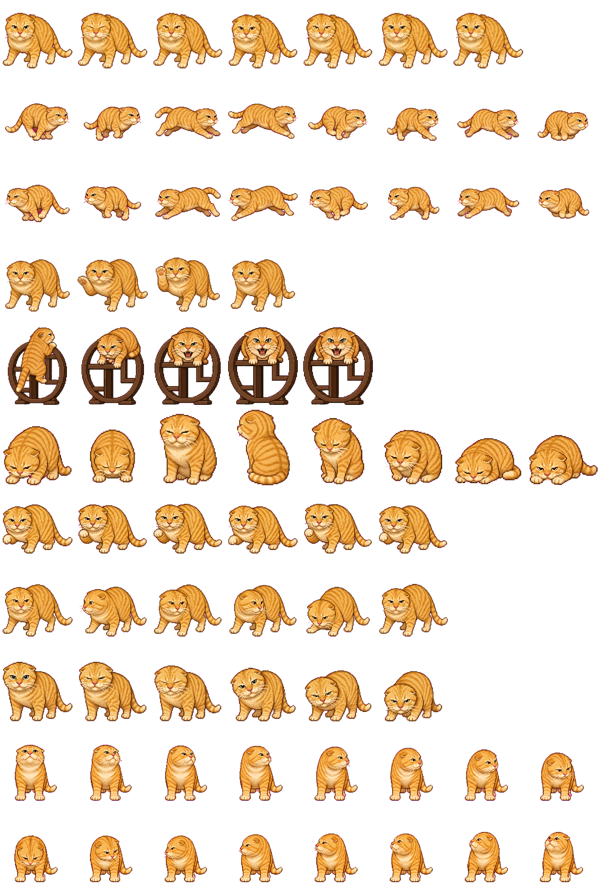

# 耄耋 Maodie

> 一只占据耄爬架、用圆头飞机耳和三连哈守护自由的橘猫。
>
> A round-headed orange cat who guards his freedom—one hiss at a time.

[中文](#关于耄耋) · [English](#about-maodie) · [安装](#安装) · [Install](#installation)

<p align="center">
  
</p>

这是我为 [Codex](https://developers.openai.com/codex/) 制作的自定义动态 pet。它的原型是中国互联网中的流浪橘猫“圆头耄耋”：圆圆的脑袋、向后贴紧的飞机耳、警惕的眼神，以及仿佛永远不肯向世界低头的气势。

现在，你也可以把它带回自己的 Codex。它会陪你写代码、等待任务、检查改动，也会在失败时安静地趴一会儿。

## 关于耄耋

### 从一只流浪猫开始

故事最初并不是传奇。

大约在 2021 年，一只橘色流浪猫出现在视频作者“白手套&马犬旺财”的投喂区域。它会来寻找食物，却一直保留着流浪动物对人和环境的戒心。面对压力时，它把耳朵压成“飞机耳”，露出近乎完美的圆脑袋，一边后退、一边哈气，认真守住不愿被越过的边界。

“圆头猫爹”后来被网友谐音写成了“圆头耄耋”。这里的“耄耋”不是说它年纪很大，而是“猫爹”的谐音。那张圆脸、飞机耳和不服输的神情迅速传遍网络；在一轮轮剪辑与二次创作里，它又拥有了“三连哈”、耄爬架和夸张的战猫传说。

但在所有传奇之前，它只是一只努力活下去、并且清楚表达自己边界的猫。飞机耳与哈气首先意味着紧张、害怕或警告。这个项目想记住它的生命力，而不是取笑它的应激。

### 为什么把它做成 pet

耄耋最打动我的，不是“战斗力”，而是那种小小身体里装不下的倔强：可以接受一顿饭，却不因此交出自由；可以害怕，也依然会表达“不”。

于是我把它画进了 Codex 的工作空间。这里的耄耋会奔跑、挥爪、跳上自己的耄爬架、等待你思考，也会陪你面对失败和 review。它不再只是一个定格在短视频里的表情，而是一只会在创作过程中继续生活的小猫。

希望它也能陪你完成下一个作品。

## 安装

项目已经按 Codex 自定义 pet 的目录结构打包，核心文件位于 [`maodie/`](./maodie/)：

```text
maodie/
├── pet.json          # 名称、描述和版本信息
└── spritesheet.webp  # 8 × 11 动画精灵图
```

### Windows（PowerShell）

```powershell
git clone https://github.com/Fai22c/MaoDie.git
Set-Location MaoDie

$petDir = Join-Path $env:USERPROFILE ".codex\pets\maodie"
New-Item -ItemType Directory -Force $petDir | Out-Null
Copy-Item -Path ".\maodie\*" -Destination $petDir -Recurse -Force
```

### macOS / Linux

```bash
git clone https://github.com/Fai22c/MaoDie.git
mkdir -p ~/.codex/pets/maodie
cp -R MaoDie/maodie/. ~/.codex/pets/maodie/
```

复制完成后，重新启动 Codex，并在 pet 选择器中选择 **耄耋**。更新本项目时，重新拉取仓库并覆盖同名目录即可。

> 如果不使用 Git，也可以在 GitHub 下载 ZIP，解压后把其中的 `maodie` 文件夹复制到 `~/.codex/pets/`。Windows 对应目录通常是 `%USERPROFILE%\.codex\pets\`。

## 动画与规格

耄耋使用 Codex pet sprite v2 格式：

- 画布：`1536 × 2288` WebP，透明背景
- 网格：8 列 × 11 行，每格 `192 × 208`
- 标准动作：待机、向右奔跑、向左奔跑、挥爪、跳跃、失败、等待、工作与 review
- 观察方向：16 个环绕视角，让耄耋能跟随工作空间中的动静转头
- 清单版本：`spriteVersionNumber: 2`

## 项目文件

- [`maodie/pet.json`](./maodie/pet.json) — Codex pet 清单
- [`maodie/spritesheet.webp`](./maodie/spritesheet.webp) — 完整动画精灵图
- [`LICENSE`](./LICENSE) — MIT License

## 关于创作与动物

本项目是爱好者制作的非官方二次创作，与 OpenAI、Codex 或原视频作者无隶属关系。“圆头耄耋”的网络故事来自公开传播的影像与二次创作；想了解原始事件，可以观看原作者整理的[“圆头耄耋”事件完整始末](https://www.bilibili.com/video/BV1WACkBYEVd/)。请尊重原作者，也请不要用追逐、惊吓或激怒动物的方式复刻相关画面。

如果你喜欢耄耋，欢迎分享这个项目、提交改进，或者制作属于你自己的 pet。对现实中的猫，请留一点食物、距离和耐心。

---

## About Maodie

Maodie is a community-made animated pet for [Codex](https://developers.openai.com/codex/), inspired by the Chinese internet rescue cat often called **Yuantou Maodie** (圆头耄耋): a stray orange tabby remembered for his perfectly round head, airplane ears, wary stare, and uncompromising spirit.

The story began around 2021, when the cat started visiting a feeding area filmed by the creator “白手套&马犬旺财.” He came for food but remained cautious around people. Under stress, he flattened his ears, backed away, and hissed to protect his space. People first called him “Yuantou Maodie” through a playful homophone of *round-headed cat dad* (圆头猫爹); it does not mean that the cat was elderly.

The internet turned those few vivid moments into a much larger legend. Fan edits gave him a triple hiss, a wooden throne known as the *Maodie climbing frame*, and the aura of an undefeated battle cat. Beneath the memes, however, was a real stray animal communicating fear and boundaries. This project celebrates his resilience without treating that stress as a joke.

I made Maodie into a Codex pet because his stubborn independence felt at home beside the creative process. He runs while work is moving, waits while you think, raises a paw, climbs onto his wooden frame, reviews changes, and rests after failure. My hope is simple: that this small orange companion can keep living in the things we make.

## Installation

Clone or download this repository, then copy the [`maodie`](./maodie/) directory to your Codex pets directory.

```text
~/.codex/pets/maodie/
├── pet.json
└── spritesheet.webp
```

- **Windows:** `%USERPROFILE%\.codex\pets\maodie\`
- **macOS / Linux:** `~/.codex/pets/maodie/`

Restart Codex after copying the files, then select **耄耋** from the pet picker. See the [Chinese installation section](#安装) for ready-to-run commands.

## License

The project files are released under the [MIT License](./LICENSE). Maodie is an unofficial fan-made interpretation; names, source footage, and third-party characters remain the property of their respective owners.

Made with respect for one very round, very determined orange cat. 🐈
