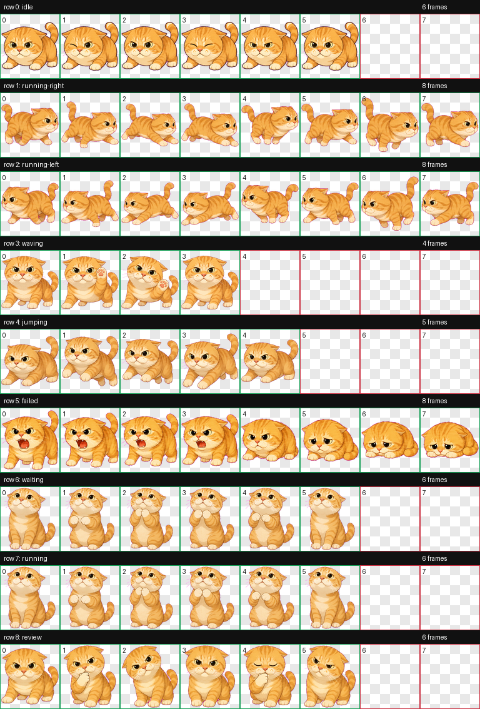
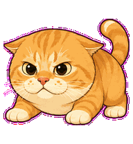
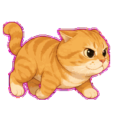
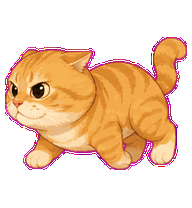
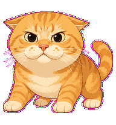
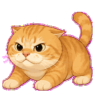
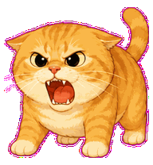
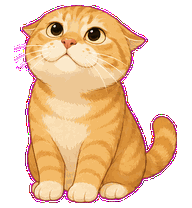
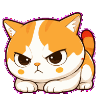

# Maodie

Maodie is a custom Codex pet inspired by the Chinese internet rescue cat known as "Yuantou Maodie": a round-headed orange tabby with airplane ears, hissing energy, and compact meme-cat body language.

## Project Contents

- `pets/maodie/pet.json`: Codex pet manifest.
- `pets/maodie/spritesheet.webp`: Codex-compatible sprite atlas.
- `docs/INSTALL.md`: setup instructions.
- `docs/ASSET_MANIFEST.md`: build artifact notes.
- `docs/contact-sheet.png`: visual QA sheet.
- `docs/previews/*.gif`: per-state animation previews.

## Pet States

Maodie includes the full Codex pet animation set:

| State | Preview |
| --- | --- |
| idle |  |
| running-right |  |
| running-left |  |
| waving |  |
| jumping |  |
| failed |  |
| waiting |  |
| running |  |
| review |  |